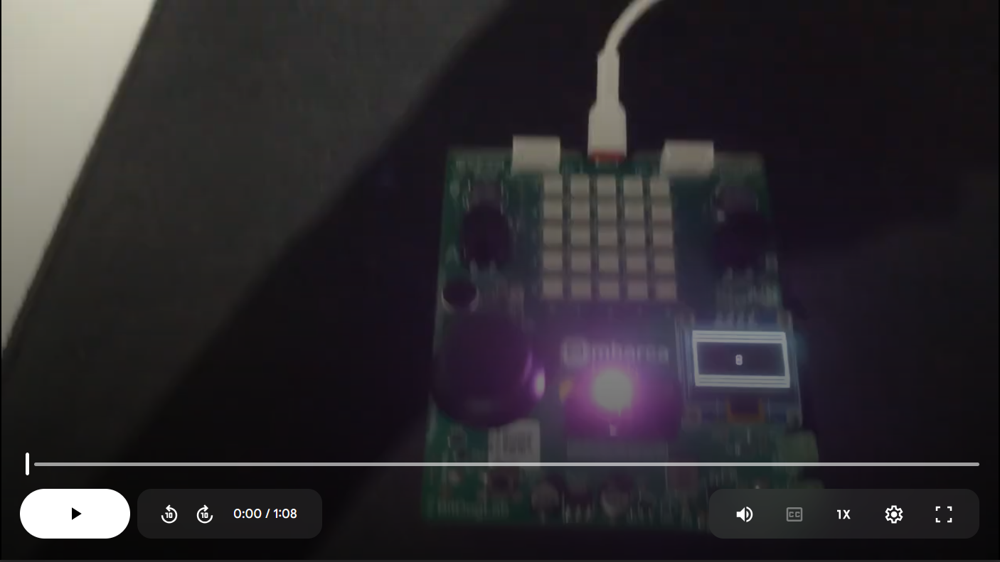

# Comunicação Serial com RP2040

Trabalho do dia 10/02/2025 do projeto EmbarcaTech

# Componentes BigDogLab

• Joystick (potenciometros X e Y) conectados aos pinos 26 e 27 respectivamente.

• LED RGB, com os pinos conectados às GPIOs (11, 12 e 13).

• Botão A conectado à GPIO 5.

• Botão JOY conectado à GPIO 22.

• Display SSD1306 conectado via I2C (GPIO 14 e GPIO15).

# Funcionalidades

1) Controlar a intensidade luminosa dos LEDs RGB, onde:
•  O LED Azul terá seu brilho ajustado conforme o valor do eixo Y. Quando o joystick estiver solto (posição central - valor 2048), o LED permanecerá apagado. À medida que o joystick for movido para cima (valores menores) ou para baixo (valores maiores), o LED aumentará seu brilho gradualmente, atingindo a intensidade máxima nos extremos (0 e 4095).
•  O LED Vermelho seguirá o mesmo princípio, mas de acordo com o eixo X. Quando o joystick estiver solto (posição central - valor 2048), o LED estará apagado. Movendo o joystick para a esquerda (valores menores) ou para a direita (valores maiores), o LED aumentará de brilho, sendo mais intenso nos extremos (0 e 4095).
•  Os LEDs serão controlados via PWM para permitir variação suave da intensidade luminosa.

2) Exibir no display SSD1306 um quadrado de 8x8 pixels, inicialmente centralizado, que se moverá proporcionalmente aos valores capturados pelo joystick.

3) o botão do joystick alterna o estado do LED Verde a cada acionamento. Modifica a borda do display para indicar quando foi pressionado, alternando entre diferentes estilos de borda a cada novo acionamento

4) o botão A ativa ou desativa os LED PWM a cada acionamento.

# Video de Funcionamento

